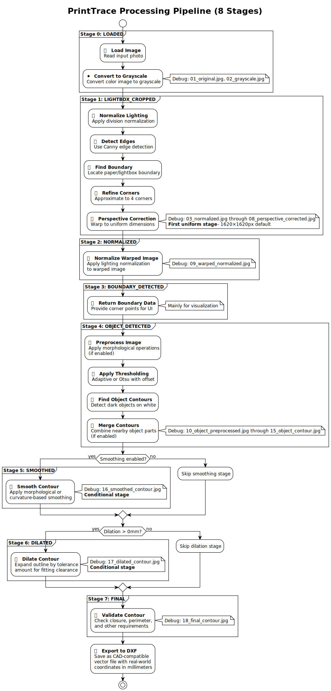

# PrintTrace - How It Works

PrintTrace converts photos of objects on a lightbox into precise DXF outlines for 3D printing and CAD applications.

## Processing Pipeline

The tool follows a 9-step process to extract clean outlines:



### Step-by-Step Process

1. **Load Image** - Read the input photo
2. **Normalize Lighting** - Even out lighting using CLAHE
3. **Detect Lightbox** - Find the bright white square boundary
4. **Perspective Correction** - Warp image to remove camera angle
5. **Object Detection** - Find the object using binary thresholding
6. **Detail Preservation** - Keep original contour points (no approximation)
7. **Smoothing** *(optional)* - Remove small details for easier 3D printing
8. **Add Tolerance** *(optional)* - Expand outline for fitting clearance
9. **Export to DXF** - Save as CAD-compatible vector file

## Key Features

### 📐 Real-World Accuracy
- Calibrates pixel-to-millimeter conversion using the lightbox size
- Sub-pixel corner refinement for maximum precision
- Maintains measurement accuracy throughout the pipeline

### 🖨️ 3D Printing Optimized
- **Smoothing**: Removes tiny details that cause print artifacts
- **Tolerance**: Adds clearance for parts to fit properly
- **Clean geometry**: Produces printer-friendly outlines

### 🔍 Debug Visualization
Enable debug mode (`-d`) to see each processing step:
- `01_original.jpg` - Input photo
- `07_warped.jpg` - After perspective correction
- `08_object_contour.jpg` - Detected object outline
- `09_smoothed_contour.jpg` - After smoothing (if enabled)
- `10_dilated_contour.jpg` - Final result with tolerance

## Usage Examples

```bash
# Basic outline extraction
printtrace -i photo.jpg

# 3D printing case with 1mm clearance
printtrace -i photo.jpg -t 1.0

# Smooth outline for easier printing
printtrace -i photo.jpg -s -t 0.5

# See all processing steps
printtrace -i photo.jpg -d
```

## Best Practices

### Photography Setup
- Use a **backlit white square** (lightbox) as background
- Place object **centered** on the lightbox
- Ensure **good contrast** between object and background
- Take photo from **directly above** when possible

### 3D Printing Tips
- Use **smoothing** (`-s`) to remove small details
- Add **tolerance** (`-t 1.0`) for fitting clearance
- Start with 0.5-1.0mm tolerance and adjust as needed

### Troubleshooting
- If lightbox detection fails: Ensure good lighting contrast
- If object outline is incomplete: Check for shadows or reflections
- If tolerance is wrong: Verify the real-world lightbox size (default: 162mm)

## Output Format

The DXF file contains:
- **Closed polyline** representing the object outline
- **Real-world coordinates** in millimeters
- **CAD-compatible** format for import into design software

## Technical Details

- **Image Processing**: OpenCV computer vision library
- **CAD Export**: LibreCAD's libdxfrw library  
- **Precision**: Sub-pixel accuracy with corner refinement
- **Performance**: Optimized for high-resolution photos (typical processing: 10-15 seconds)